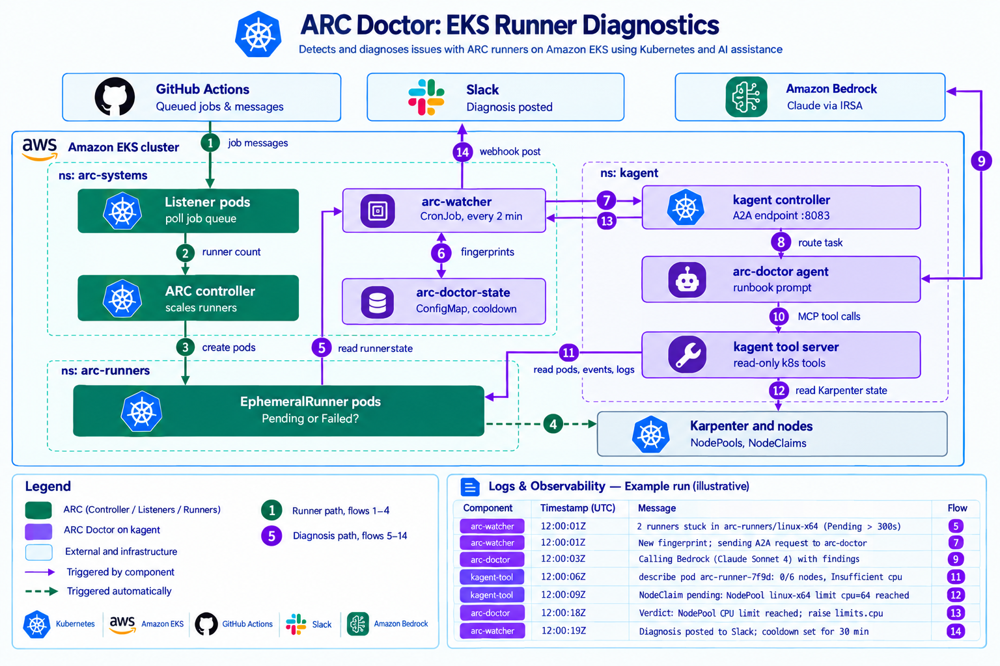
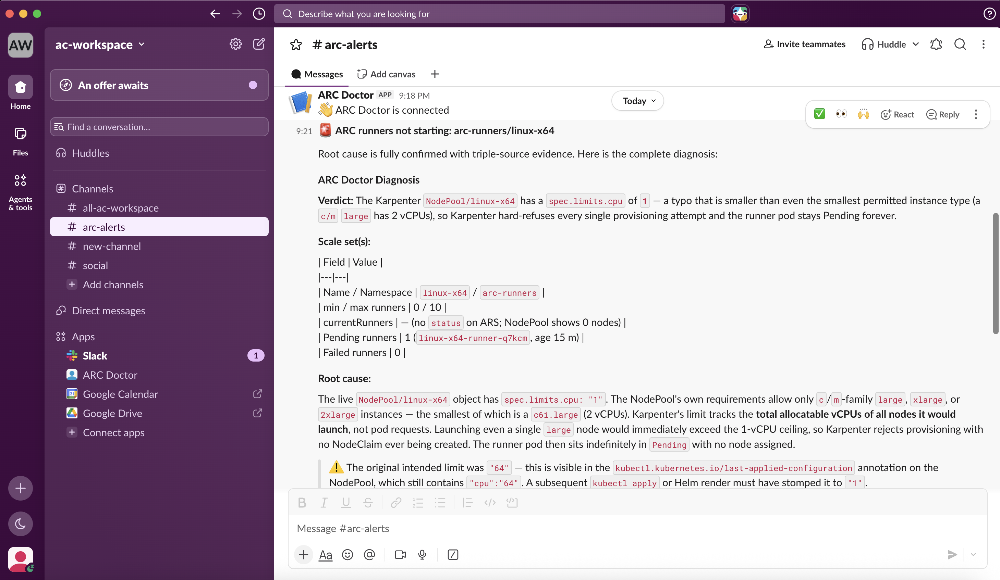

# ARC Doctor on EKS

An AI agent that explains why GitHub Actions jobs are queued but self-hosted
runners don't start. It runs inside Amazon EKS on [kagent](https://kagent.dev)
with Claude Sonnet 4.6 on Amazon Bedrock, watches
[Actions Runner Controller (ARC)](https://github.com/actions/actions-runner-controller)
and [Karpenter](https://karpenter.sh), and posts a root-cause diagnosis to
Slack.

All 14 data flows were built and verified on a live cluster (EKS 1.36,
us-east-2) on 2026-10-08. The [verification matrix](docs/verification-matrix.md)
and the [evidence logs](evidence/) back every claim below.



## What it does

1. A GitHub job queues; the ARC listener picks it up and the controller creates
   a runner pod.
1. Karpenter launches a node for the pod, from a tainted `linux-x64` NodePool.
1. Every 2 minutes, the `arc-watcher` CronJob looks for runners stuck more than
   5 minutes, failed runners, and unhealthy listeners.
1. On a new problem, it calls the `arc-doctor` agent over A2A.
1. The agent investigates with read-only Kubernetes tools and Claude on Bedrock,
   then returns a verdict, quoted evidence, a fix and a confidence level.
1. The watcher posts the diagnosis to Slack.

## Results

| Test                                    | Result                                                                                                      |
| --------------------------------------- | ----------------------------------------------------------------------------------------------------------- |
| Job → runner → new node                 | c6a.large Ready in 38 s, job done in 59 s ([log](evidence/05-smoke-test-karpenter-scale-up.log))            |
| Healthy cluster                         | Watcher: `All ARC scale sets healthy.`; agent: correct "idle 0/10" report                                   |
| Failure drill: NodePool `limits.cpu: 1` | Detected in one watcher run; diagnosis in about 34 s; root cause, evidence and fix correct; posted to Slack |



## Repo layout

| Path                                                         | Contents                                                        |
| ------------------------------------------------------------ | --------------------------------------------------------------- |
| [`docs/architecture.md`](docs/architecture.md)               | Components and design choices                                   |
| [`docs/data-flows.md`](docs/data-flows.md)                   | The 14-flow matrix: what moves, channel, identity, evidence     |
| [`docs/verification-matrix.md`](docs/verification-matrix.md) | Every test, expected vs actual, with evidence links             |
| [`docs/install-guide.md`](docs/install-guide.md)             | The exact install sequence that was run                         |
| [`docs/lessons-learned.md`](docs/lessons-learned.md)         | 17 issues hit during the build and how each was fixed           |
| [`evidence/`](evidence/)                                     | Terminal logs from the live run (IDs masked)                    |
| [`manifests/`](manifests/)                                   | kagent ModelConfig and Agent, tool-server RBAC, watcher CronJob |
| [`watcher/arc-watch.sh`](watcher/arc-watch.sh)               | Detection, A2A call, Slack post, cooldown                       |
| [`karpenter/`](karpenter/)                                   | Karpenter 1.14.1 install scripts, Helm values, runner NodePool  |
| [`arc/linux-x64-values.yaml`](arc/linux-x64-values.yaml)     | Runner scale set aimed at the Karpenter pool                    |
| [`iam/`](iam/)                                               | Bedrock invoke policy for the agent's IRSA role                 |
| [`.github/workflows/`](.github/workflows/)                   | Smoke-test workflow and on-demand diagnosis workflow            |
| [`diagram/`](diagram/)                                       | Data-flow diagram source (HTML/SVG)                             |

## Versions

| Component                    | Version                                                         |
| ---------------------------- | --------------------------------------------------------------- |
| Amazon EKS                   | 1.36                                                            |
| Karpenter                    | 1.14.1                                                          |
| ARC (`gha-runner-scale-set`) | 0.15.0                                                          |
| kagent                       | 0.10.3 (A2A protocol 0.3)                                       |
| Model                        | Claude Sonnet 4.6 (`us.anthropic.claude-sonnet-4-6`) on Bedrock |
| Helm                         | 4.2.4                                                           |

## Quick start

See [docs/install-guide.md](docs/install-guide.md). In short:

```bash
# 1. Karpenter
source karpenter/00-env.sh && for s in karpenter/0[1-5]-*.sh; do bash "$s"; done
# 2. ARC: controller + scale set (set githubConfigUrl first)
# 3. kagent (bundled agents off) + Bedrock IRSA role
# 4. ARC Doctor
kubectl apply -k .
```

Before deploying, replace the placeholder account ID `111122223333` in
`manifests/02-agent.yaml` and `iam/bedrock-invoke-policy.json`.

## Safety

- The agent's tools are read-only (get, describe, YAML, events, logs), and its
  RBAC has no Secret access.
- AWS access goes through IRSA only; there are no static keys.
- Nothing connects into the cluster. GitHub, Bedrock and Slack are all reached
  by outbound calls.
- The PAT and Slack webhook are stored as Kubernetes Secrets and were entered
  with `read -s`.
