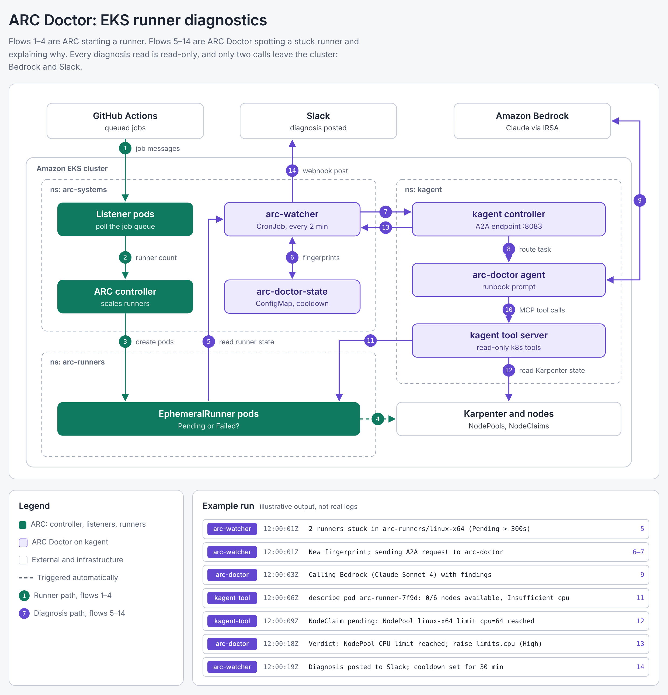

# Data flows

Every arrow on the [architecture diagram](images/architecture.png) is one of the
14 flows below. Each one was exercised on the live cluster `ac-ws-dev-use2` on
2026-10-08; the last column links to the evidence.

Only two flows leave the cluster (Bedrock and Slack), and both are opened from
inside. The diagnosis path never writes to the cluster except its own cooldown
ConfigMap (flow 6), and never reads Secrets.

## Flow matrix

| #   | From → to                        | What moves                                                    | Channel                                   | Identity                                                | Verified | Evidence                                                                                                   |
| --- | -------------------------------- | ------------------------------------------------------------- | ----------------------------------------- | ------------------------------------------------------- | -------- | ---------------------------------------------------------------------------------------------------------- |
| 1   | GitHub → listener pod            | Job-available messages for the scale set                      | HTTPS long-poll, opened by the listener   | GitHub PAT (classic, `repo`)                            | ✅       | [04](../evidence/04-arc-install.log), [05](../evidence/05-smoke-test-karpenter-scale-up.log)               |
| 2   | Listener → ARC controller        | Desired runner count (EphemeralRunnerSet replicas)            | Kubernetes API                            | Listener ServiceAccount                                 | ✅       | [05](../evidence/05-smoke-test-karpenter-scale-up.log)                                                     |
| 3   | ARC controller → runner pod      | EphemeralRunner + pod with JIT runner config                  | Kubernetes API                            | Controller ServiceAccount                               | ✅       | [05](../evidence/05-smoke-test-karpenter-scale-up.log)                                                     |
| 4   | Pending runner pod → Karpenter   | Unschedulable pod → NodeClaim → EC2 c6a.large                 | Scheduler, EC2 API                        | `KarpenterControllerRole` (IRSA)                        | ✅       | [05](../evidence/05-smoke-test-karpenter-scale-up.log)                                                     |
| 5   | ARC objects → arc-watcher        | EphemeralRunner phase/age, listener readiness, scale set list | Kubernetes API, get/list                  | `arc-watcher` ServiceAccount                            | ✅       | [14](../evidence/14-watcher-healthy.log), [17](../evidence/17-failure-drill-cronjob-slack.log)             |
| 6   | arc-watcher ⇄ `arc-doctor-state` | Failure fingerprints + last-diagnosed time (30 min cooldown)  | Kubernetes API                            | Role on one ConfigMap                                   | ✅       | [17](../evidence/17-failure-drill-cronjob-slack.log)                                                       |
| 7   | arc-watcher → kagent controller  | A2A `message/send` with findings JSON                         | HTTP :8083, JSON-RPC, A2A 0.3, in-cluster | none (in-cluster)                                       | ✅       | [16](../evidence/16-failure-drill-local-watcher.log), [17](../evidence/17-failure-drill-cronjob-slack.log) |
| 8   | kagent controller → arc-doctor   | Task routed to the agent pod                                  | In-cluster                                | kagent                                                  | ✅       | [13](../evidence/13-a2a-healthy-diagnosis.log)                                                             |
| 9   | arc-doctor ⇄ Bedrock             | Prompt + tool results out, reasoning back                     | HTTPS, SigV4                              | `arc-doctor-bedrock` (IRSA, `bedrock:InvokeModel` only) | ✅       | [10](../evidence/10-bedrock-role-and-tools.log), [13](../evidence/13-a2a-healthy-diagnosis.log)            |
| 10  | arc-doctor → tool server         | MCP tool calls: get, describe, YAML, events, logs             | MCP over HTTP (`kagent-tools:8084/mcp`)   | kagent                                                  | ✅       | [10](../evidence/10-bedrock-role-and-tools.log)                                                            |
| 11  | Tool server → runner pods        | Pod status, scheduling events, logs                           | Kubernetes API, read-only                 | `kagent-tools` SA + `arc-doctor-readonly`               | ✅       | [17](../evidence/17-failure-drill-cronjob-slack.log)                                                       |
| 12  | Tool server → Karpenter          | NodePool spec/status, NodeClaims, controller logs             | Kubernetes API, read-only                 | Same as 11                                              | ✅       | [16](../evidence/16-failure-drill-local-watcher.log), [17](../evidence/17-failure-drill-cronjob-slack.log) |
| 13  | kagent controller → arc-watcher  | Markdown diagnosis: verdict, evidence, fix, confidence        | A2A response on the same call             | —                                                       | ✅       | [16](../evidence/16-failure-drill-local-watcher.log), [17](../evidence/17-failure-drill-cronjob-slack.log) |
| 14  | arc-watcher → Slack              | Diagnosis (first 2,900 chars, Slack mrkdwn)                   | HTTPS incoming webhook, outbound          | Webhook URL in Secret `arc-doctor-slack`                | ✅       | [18](../evidence/18-slack-connection.log), [screenshot](images/slack-diagnosis.png)                        |

## Example run (from the failure drill)

| Component   | Time (UTC)  | Message                                                                                       | Flow |
| ----------- | ----------- | --------------------------------------------------------------------------------------------- | ---- |
| arc-watcher | 04:21:06    | Detected 1 finding(s): `arc-runners/linux-x64:runners`                                        | 5, 6 |
| arc-watcher | 04:21:06    | Sending diagnosis request to kagent-controller:8083                                           | 7    |
| arc-doctor  | 04:21:06–40 | Bedrock (Claude Sonnet 4.6) + tool calls                                                      | 8–12 |
| kagent-tool | —           | Karpenter log: `all available instance types exceed limits for nodepool (NodePool=linux-x64)` | 12   |
| arc-doctor  | 04:21:40    | Verdict: NodePool `limits.cpu: 1` is below the smallest allowed node (2 vCPU)                 | 13   |
| arc-watcher | 04:21:40    | Diagnosis posted to `#arc-alerts`                                                             | 14   |

## What never moves

- No Kubernetes Secrets are read by the agent or the tool server. Bad GitHub
  credentials are inferred from listener logs.
- No writes from the diagnosis path, except `arc-doctor-state` (flow 6).
- No inbound connections from outside the cluster. GitHub, Bedrock and Slack are
  all reached by outbound calls.
